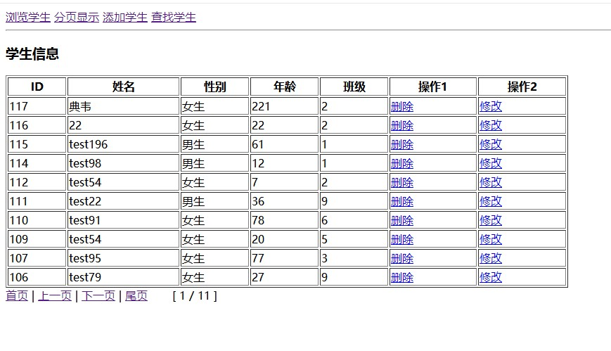
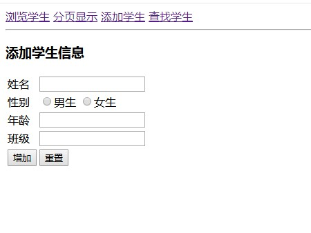
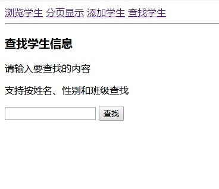
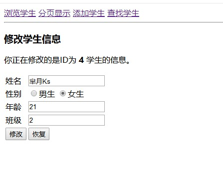

# 学生信息管理（SAMS）
使用PHP + MySQL实现一个简单的学生信息管理小项目。
该项目全原生，没有使用框架也没有用模板引擎，整体布局稍有混乱，其中
对数据库的操作用的是mysqli，以面向过程的方式操作数据库。


## 用到的数据库
```sql
CREATE DATABASE sams DEFAULT CHARACTER SET utf8 COLLATE utf8_general_ci;
USE sams;

CREATE TABLE stu (
	id INT(12) UNSIGNED NOT NULL AUTO_INCREMENT,
	name VARCHAR(20) DEFAULT NULL, 
	sex CHAR(1) DEFAULT NULL, 
	age INT(4) DEFAULT NULL,
	classid INT(6) DEFAULT NULL,
	PRIMARY KEY (id)
)ENGINE=MyISAM DEFAULT CHARSET=utf8;

INSERT INTO stu (name, sex, age, classid) VALUES 
('slo', 'f', '21', '0'),
('李白', 'm', '121', '1'),
('slo', 'f', '21', '0'),
('slo', 'f', '21', '0');
```

## 文件布局说明
list.php 这个文件使用来渲染显示数据库查询结果的，定义了分页显示和不分页显示。

index.php 入口文件，该页面用来显示学生列表。分三种情况，默认显示全部学生，当
检测到分页变量page时，以分页显示，当有sql查询参数传来时，则按查询参数显示。

add.php 添加学生
edit.php 编辑学生
search.php 查找学生
page.php 点击上下一页时，用次来显示分页结果
menu.php 菜单

action.php 该文件是对所有操作进行处理，是核心文件。通过匹配GET方法传参的值，来确定
需要选取的操作。

## 测试数据生成工具
运行下面的JS代码，可以批量生成测试数据。
```html
<!-- 本程序可以自动输出一些随机的学生模拟数据，以方便测试 -->
<!DOCTYPE html>
<html>
<head>
	<meta charset="utf-8">
    <title></title>
    <style>
        body { font-family: consolas; }
    </style>
</head>
<body>
<script>

var testTotalNumber = 100; // 生成测试学生数据的数量
var resultString = "INSERT INTO stu (name, sex, age, classid) VALUES"; // 存放结果字符串
var name = "";
var sex = "";
var age = "";
var classid = "";
var tempString = "";

// ('slo', 'f', '21', '0'),
for (var i=0; i<testTotalNumber; i++) {
    var r0_1 = parseInt(Math.random() * 2); // 性别_随机生成 0 或 1
    var r0_11 = parseInt(Math.random() * 11 + 1); // 班级_生成 1-12 之间的随机数
    var r5_88 = parseInt(Math.random() * 84 + 5); // 年龄_生成 5-88 之间的随机数

    // 名字随机
    var name = "test" + parseInt( Math.random() * 2 * testTotalNumber );
    // 性别随机
    if (r0_1) {
        sex = "m";
    } else {
        sex = "f";
    }
    // 年龄随机
    age = r5_88;
    // 班级随机
    classid = r0_11;
    
    tempString += "('" + name + "','" + sex + "','" + age + "','" + classid + "'),<br>";
}

resultString += tempString;
document.write(resultString);
</script>
</body>
</html>
```

## 示例图片





## 参考链接
极客学院 PDO 项目实例——学生信息管理系统
http://www.jikexueyuan.com/course/654.html

MySQL Tutorial
https://dev.mysql.com/doc/refman/5.7/en/


